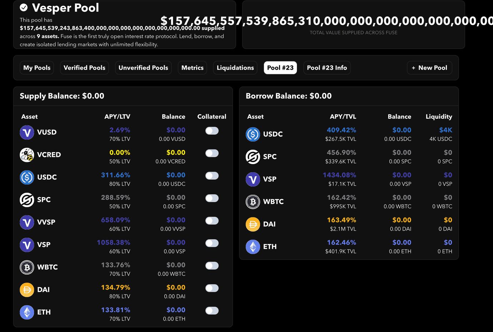

# Rari Fuse VUSD Price Manipulation

This is a foundry implementation of the Rari Fuse VUSD Price Manipulation PoC by [MrToph](https://github.com/MrToph).

Check out the original [blog post](https://cmichel.io/replaying-ethereum-hacks-rari-fuse-vusd-price-manipulation/) and [github repo](https://github.com/MrToph/replaying-ethereum-hacks) for more info.

## Test

Set up `.env` using `.env.template`, the RPC endpoint is used for mainnet forking.

```bash
forge install
forge test [-vv]
```

## Screenshot

